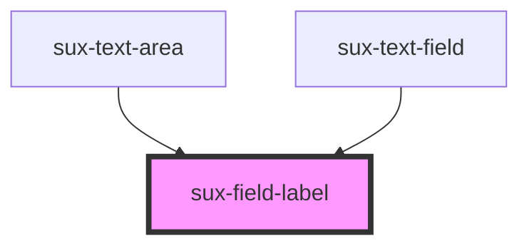

# sux-field-label

<!-- Auto Generated Below -->

## Properties

| Property   | Attribute  | Description | Type                        | Default     |
| ---------- | ---------- | ----------- | --------------------------- | ----------- |
| `disabled` | `disabled` | Disabled    | `boolean`                   | `false`     |
| `label`    | `label`    | Label       | `string`                    | `undefined` |
| `position` | `position` | position    | `"side" \| "top"`           | `'top'`     |
| `required` | `required` | Required    | `boolean`                   | `false`     |
| `size`     | `size`     | Size        | `"l" \| "m" \| "s" \| "xl"` | `'s'`       |

## Dependencies

### Used by

 - [sux-text-area](../sux-text-area)
 - [sux-text-field](../sux-text-field)

### Graph

----------------------------------------------

*Built with [StencilJS](https://stenciljs.com/)*
