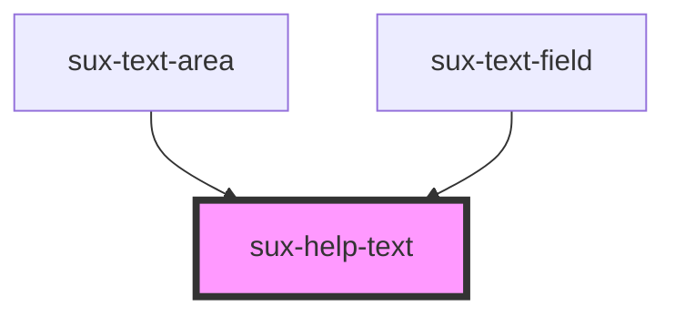

# sux-help-text

<!-- Auto Generated Below -->

## Properties

| Property   | Attribute  | Description | Type                        | Default     |
| ---------- | ---------- | ----------- | --------------------------- | ----------- |
| `disabled` | `disabled` | disabled    | `boolean`                   | `false`     |
| `icon`     | `icon`     | Icon        | `boolean`                   | `false`     |
| `size`     | `size`     | size        | `"l" \| "m" \| "s" \| "xl"` | `'s'`       |
| `text`     | `text`     | text        | `string`                    | `''`        |
| `variant`  | `variant`  | Variant     | `"negative" \| "neutral"`   | `'neutral'` |

## Dependencies

### Used by

 - [sux-text-area](../sux-text-area)
 - [sux-text-field](../sux-text-field)

### Graph

----------------------------------------------

*Built with [StencilJS](https://stenciljs.com/)*
