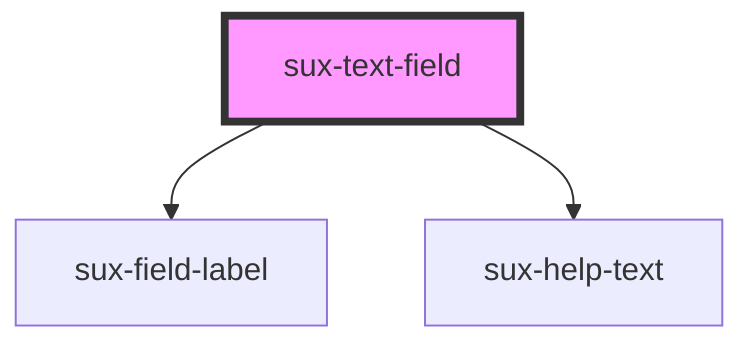

# sux-text-field

<!-- Auto Generated Below -->

## Properties

| Property        | Attribute        | Description        | Type                                                                        | Default     |
| --------------- | ---------------- | ------------------ | --------------------------------------------------------------------------- | ----------- |
| `disabled`      | `disabled`       | disabled input     | `boolean`                                                                   | `false`     |
| `error`         | `error`          | Error              | `boolean`                                                                   | `false`     |
| `errorText`     | `error-text`     | Error message      | `string`                                                                    | `undefined` |
| `helpText`      | `help-text`      | Help text          | `string`                                                                    | `undefined` |
| `label`         | `label`          | Label text         | `string`                                                                    | `undefined` |
| `labelPosition` | `label-position` | Label position     | `"side" \| "top"`                                                           | `'top'`     |
| `placeholder`   | `placeholder`    | Placeholder text   | `string`                                                                    | `undefined` |
| `readonly`      | `readonly`       | read only          | `boolean`                                                                   | `false`     |
| `required`      | `required`       | Required           | `boolean`                                                                   | `false`     |
| `size`          | `size`           | size of the input  | `"l" \| "m" \| "s" \| "xl"`                                                 | `'m'`       |
| `type`          | `type`           | Input type         | `"email" \| "number" \| "password" \| "search" \| "tel" \| "text" \| "url"` | `'text'`    |
| `validIcon`     | `valid-icon`     | valid icon         | `boolean`                                                                   | `false`     |
| `value`         | `value`          | value of the input | `string`                                                                    | `undefined` |
| `width`         | `width`          | width of the input | `string`                                                                    | `undefined` |

## Events

| Event       | Description                                                            | Type               |
| ----------- | ---------------------------------------------------------------------- | ------------------ |
| `suxblur`   | Fired when an element has lost focus                                   | `CustomEvent<any>` |
| `suxchange` | /**     Fired when the value of the input changes                      | `CustomEvent<any>` |
| `suxinput`  | Fired when an alteration to the input's value is committed by the user | `CustomEvent<any>` |

## Shadow Parts

| Part           | Description |
| -------------- | ----------- |
| `"form-field"` |             |

## Dependencies

### Depends on

- [sux-field-label](../sux-field-label)
- [sux-help-text](../sux-help-text)

### Graph

----------------------------------------------

*Built with [StencilJS](https://stenciljs.com/)*
